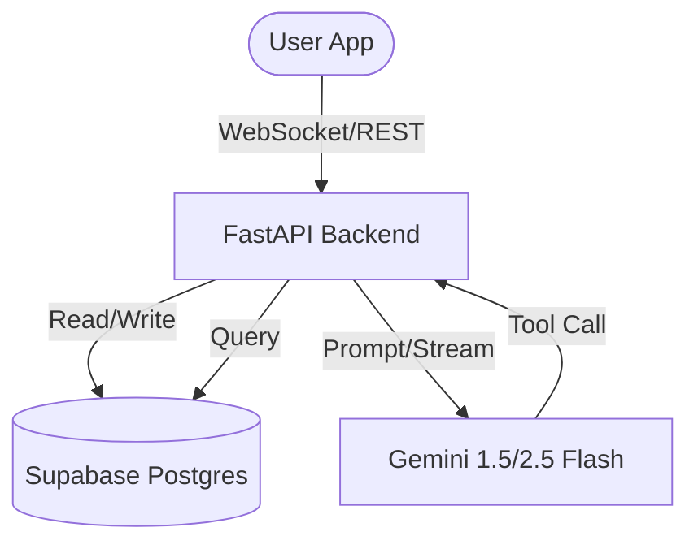

# Explanation: Architecture

Volc is built with a modern, cloud-native architecture designed for real-time AI coaching and heavy data analysis. This document explains the high-level components and how they interact.

---

## High-Level Diagram

---

## Core Components

### 📱 Frontend (Mobile App)

- **Framework**: React Native with Expo.
- **State Management**: Zustand (stores for Chat, Workouts, and Sessions).
- **Communication**:
  - **WebSockets**: Used for real-time AI streaming and low-latency interaction.
  - **REST API**: Used for traditional CRUD operations (profiles, logs, settings).

### 🖥️ Backend (Python API)

- **Framework**: FastAPI.
- **Orchestration**: Manages the lifecycle of AI conversations, session persistence, and data processing.
- **Task Scheduling**: Uses `APScheduler` for background tasks like memory extraction and workout analysis.

### 🧠 AI Engine (Coach Logic)

- **Model**: Google Gemini (1.5 Pro or 2.5 Flash).
- **Framework**: LangChain.
- **Capabilities**:
  - **Streaming Reasoning**: The coach "thinks" before responding, visible as thoughts in the UI.
  - **Tool Calling**: The AI can query strength exercises, cardio data, and user history to provide personalized recommendations.
  - **Contextual Memory**: Automatically extracts and summarizes key user details from conversations to improve future coaching.

### 🗄️ Database & Auth

- **Provider**: Supabase.
- **Postgres**: Stores workout logs, user profiles, and chat history.
- **Auth**: Secure JWT-based authentication integrated across mobile and backend.

---

## Key Data Flows

### 1. The Coaching Loop

When a user sends a message, the `WebSocketService` routes it to the `UnifiedCoachService` on the backend. The service:

1. Loads the user's "Context Bundle" (recent workouts, strength tiers, AI memory).
2. Sends the context and message history to Gemini.
3. Gemini determines if it needs more data (e.g., looking up a specific exercise) and triggers a **Tool Call**.
4. The backend executes the tool and returns the result to Gemini.
5. Gemini streams the final response (and its internal reasoning) back to the user.

### 2. Workout Synchronization

Volc is designed to handle "spotty" gym Wi-Fi:

1. Completed workouts are first saved to a local `pendingWorkoutQueue`.
2. A background process (`WorkoutStore`) attempts to sync these to Supabase.
3. Once confirmed, the frontend state updates, and the AI coach is notified to prepare a post-workout analysis.
